{width=14.6cm}

Міністерство освіти та науки України

Національний технічний університет України

«Київський політехнічний інститут імені Ігоря Сікорського»

Факультет інформатики та обчислювальної техніки

Кафедра обчислювальної техніки

[[space:4]]

**Звіт**

з дисципліни «Аналіз та обробка часових рядів (Time Series)»

Лабораторна робота №1

«Отримання та підготовка Time Series»

Варіант 8, III рівень складності

[[space:6]]

::: {custom-style="Титульний лівий"}
**[Виконав:]{.underline}**

Студент IV курсу

гр. ІП-33

Соколов О. В.

**[Прийняв:]{.underline}**

Писарчук О. О.

«\_\_\_» \_\_\_\_\_\_\_\_\_\_\_\_ 2026 р.
:::

[[space:11]]

**Київ – 2026**

---

# І. Мета

Виявити, дослідити та узагальнити особливості отримання та підготовки Time Series з
використанням спеціалізованих пакетів мови програмування Python.

# ІІ. Завдання

Розробити програмний скрипт мовою Python, що забезпечує аналіз властивостей і
характеристик вихідних даних для універсальної платформи обробки Big Data – прогнозування
курсів валют, метеоумов, епідеміологічних показників.

Умови варіанта 8 (табл. 1 додатку 1):

Таблиця 1 – Умови варіанта 8

| Рівень | Закон зміни похибки | Закон зміни тренду | Реальні дані |
| --- | --- | --- | --- |
| I (7 балів) | нормальний | квадратичний | 1 показник |
| II (8 балів) | нормальний, експоненційний | квадратичний, лінійний | 3 показники |

Комбінаторика похибка / тренд – довільна.

Завдання III рівня (10 балів): провести парсинг самостійно обраного сайту; зберегти
результати парсингу у файлі; оцінити динаміку тренду реальних даних; визначити статистичні
характеристики результатів парсингу; синтезувати та верифікувати модель даних, аналогічних
за трендом і статистичними характеристиками реальним даним.

Етапи роботи:

1. Модель генерації випадкової величини за заданим законом розподілу.
2. Модель зміни (ідеальний тренд) досліджуваного процесу.
3. Адитивна модель статистичної вибірки.
4. Визначення статистичних характеристик сформованих вибірок.
5. Визначення статистичних характеристик реальних даних `Oschadbank (USD).xls`.
6. Аналіз отриманих результатів та верифікація розробленого скрипта.

# ІІІ. Результати виконання лабораторної роботи

## 3.1. Синтезована математична модель

Модель складається з трьох компонент: стохастичної (випадкова похибка), невипадкової
(ідеальний тренд) та адитивної суміші обох.

### 3.1.1. Модель генерації випадкової величини

Нормальний закон розподілу.

Щільність розподілу ймовірностей:

$$f(x, m_x, \sigma_x) = \frac{1}{\sigma_x \sqrt{2\pi}} \exp\left(-\frac{(x – m_x)^2}{2\sigma_x^2}\right)$$

де $x$ – випадкова величина; $m_x$, $\sigma_x$ – параметри закону розподілу.

Числові характеристики: $M[x] = m_x$, $D[x] = \sigma_x^2$.

Прийняті параметри: $m_x = 0$, $\sigma_x = 5$, отже $D[x] = 25$.

Експоненційний закон розподілу.

Щільність розподілу ймовірностей:

$$f(x, \lambda) = \frac{1}{\lambda} e^{-x/\lambda}, \quad x \ge 0$$

де $\lambda$ – масштабний параметр закону розподілу.

Числові характеристики: $M[x] = \lambda$, $D[x] = \lambda^2$.

Прийнятий параметр: $\lambda = 5$, отже $M[x] = 5$, $D[x] = 25$.

Принципова відмінність від нормального закону – ненульове математичне сподівання.
Як адитивна похибка експоненційний закон зміщує вибірку відносно ідеального тренду
на величину $\lambda$, що підтверджується результатами п. 3.4.

### 3.1.2. Модель ідеального тренду

Лінійна модель:

$$S(t) = a_0 + a_1 t$$

Прийняті параметри: $a_0 = 10$, $a_1 = 0{,}05$.

Квадратична модель:

$$S(t) = a_0 + a_1 t + a_2 t^2$$

Прийняті параметри: $a_0 = 10$, $a_1 = 0{,}01$, $a_2 = 0{,}0001$.

### 3.1.3. Адитивна модель статистичної вибірки

Модель окремої реалізації експериментальної вибірки – адитивна суміш невипадкової та
випадкової складових:

$$Y(t) = S(t) + \varepsilon(t)$$

де $S(t)$ – ідеальний тренд, $\varepsilon(t)$ – випадкова похибка.

За наявності аномальних вимірів (АВ):

$$Y(t) = S(t) + \varepsilon(t) + Q \cdot \varepsilon_{AB}(t)$$

де $Q$ – коефіцієнт переваги аномальних вимірів, а номери аномальних відліків розподілені
рівномірно в межах вибірки. Прийнято $Q = 3$ за частки АВ 10 %.

### 3.1.4. Методика визначення статистичних характеристик

Статистичні характеристики похибки визначаються не за самою вибіркою, а за залишком
після виділення систематичної складової (тренду). Інакше дисперсія вибірки характеризує
тренд, а не похибку.

1. Виділення тренду за методом найменших квадратів (МНК).

Матриця плану для полінома степеня $k$:

$$F = \begin{pmatrix} 1 & t_1 & t_1^2 & \cdots & t_1^k \\ 1 & t_2 & t_2^2 & \cdots & t_2^k \\ \vdots & \vdots & \vdots & & \vdots \\ 1 & t_n & t_n^2 & \cdots & t_n^k \end{pmatrix}$$

Вектор коефіцієнтів та згладжений ряд:

$$C = (F^T F)^{-1} F^T Y, \qquad \hat{Y} = F C$$

2. Залишок (оцінка випадкової складової): $\quad \varepsilon_i = y_i – \hat{y}_i$

3. Числові характеристики залишку:

$$m_y = \frac{1}{n}\sum_{i=1}^{n} y_i, \qquad D_y = \frac{1}{n}\sum_{i=1}^{n}(y_i – m_y)^2, \qquad \sigma_y = \sqrt{D_y}$$

4. Достовірність апроксимації (coefficient of determination):

$$R^2 = 1 – \frac{\sum_{i=1}^{n}(y_i – \hat{y}_i)^2}{\sum_{i=1}^{n}(y_i – \bar{y})^2}$$

> Примітка: використано зміщену оцінку дисперсії з дільником $n$. За обсягу вибірки
> $n = 500$ відмінність від незміщеної оцінки з дільником $n-1$ становить 0,2 % і на
> висновки не впливає.

## 3.2. Блок-схема алгоритму та її опис

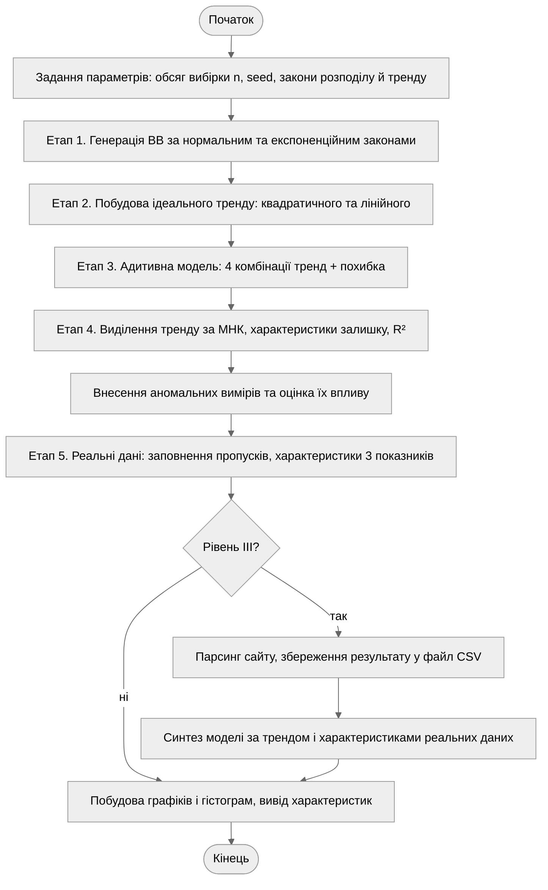

Рисунок 1 – Блок-схема алгоритму програми

Алгоритм лінійний: етапи завдання виконуються послідовно, розгалуження одне – блок
завдання III рівня виконується лише за відповідного рівня складності.

На вході задаються обсяг вибірки $n = 500$, зерно генератора `seed = 42`, параметри
законів розподілу ($m = 0$, $\sigma = 5$ для нормального; $\lambda = 5$ для
експоненційного) та параметри законів тренду. Фіксоване зерно забезпечує відтворюваність
результатів між запусками. Кожен етап друкує числові характеристики та зберігає
відповідні графіки у каталог `docs/report/assets/`.

## 3.3. Опис структури проекту програми

Проект реалізовано мовою Python. Бізнес-логіку розділено на модулі за етапами завдання.

```
lab-1/project/
├── pyproject.toml          залежності, конфігурація ruff та pyright
├── justfile                команди: sync, run, lint, fmt, check, clean
├── uv.lock                 зафіксовані версії залежностей
└── src/
    ├── main.py             точка входу, послідовний прогін етапів
    ├── config.py           параметри варіанта та експерименту
    ├── paths.py            шляхи до файлів реальних даних і output/
    ├── distributions.py    етап 1: закони розподілу ВВ + теоретичні характеристики
    ├── trends.py           етап 2: закони зміни тренду
    ├── models.py           етап 3: адитивна модель, аномальні виміри
    ├── stats.py            етап 4: числові характеристики, МНК, R²
    ├── parsing.py          етап 5: читання .xls, парсинг сайту, заповнення пропусків
    ├── synthesis.py        III рівень: синтез моделі за реальними даними
    └── plotting.py         графіки та гістограми
```

Рисунок 2 – Структура проекту

Використані бібліотеки: `numpy` – генерація ВВ та матричні обчислення; `pandas` – читання
`.xls`/`.xlsx` та збереження результатів парсингу; `requests` + `beautifulsoup4` + `lxml` –
парсинг веб-сторінки; `matplotlib` – візуалізація; `scipy` – наукові обчислення.

## 3.4. Результати роботи програми

Усі результати отримано за `seed = 42` і відтворюються при повторному запуску.

### Етап 1. Генерація випадкової величини

Таблиця 2 – Характеристики згенерованої випадкової величини

| Закон | $M$ розраховано | $M$ теоретично | $D$ розраховано | $D$ теоретично | СКВ |
| --- | --- | --- | --- | --- | --- |
| нормальний | −0,0656 | 0,0000 | 22,9908 | 25,0000 | 4,7949 |
| експоненційний | 5,1224 | 5,0000 | 28,1176 | 25,0000 | 5,3026 |

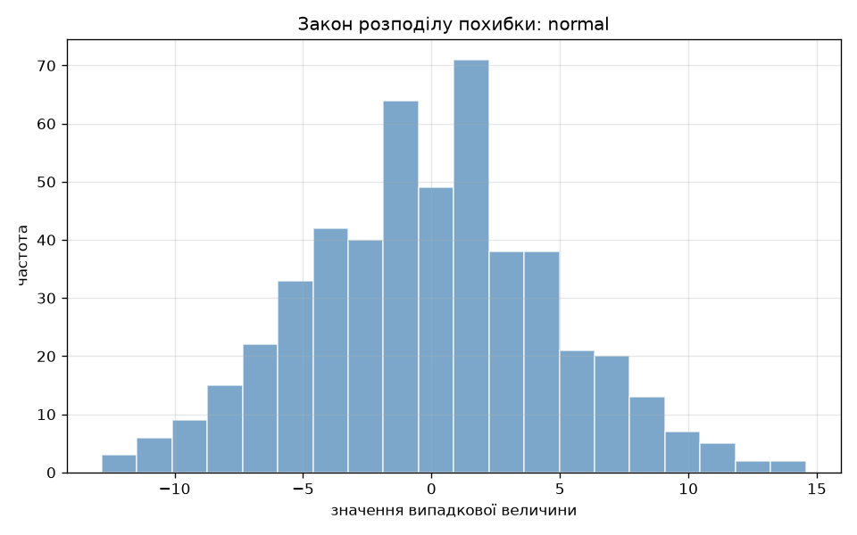

Рисунок 3 – Гістограма розподілу похибки за нормальним законом

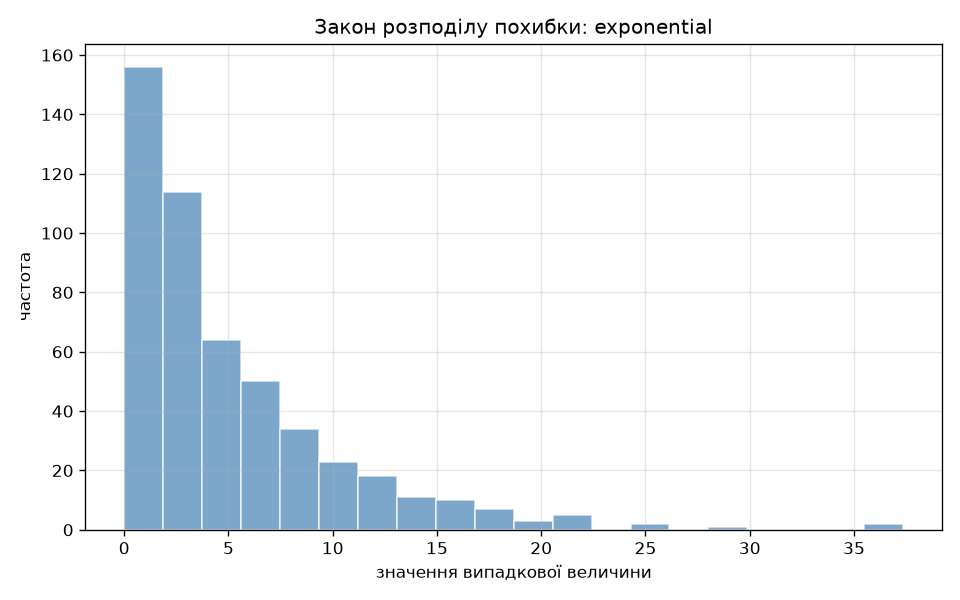

Рисунок 4 – Гістограма розподілу похибки за експоненційним законом

Форма гістограм відповідає теоретичним щільностям розподілу: симетрична дзвоноподібна
для нормального закону та спадна для експоненційного.

### Етап 2. Ідеальний тренд

Таблиця 3 – Параметри та крайні значення ідеального тренду

| Закон | Параметри | $S(0)$ | $S(n-1)$ |
| --- | --- | --- | --- |
| квадратичний | $a_0=10$, $a_1=0{,}01$, $a_2=0{,}0001$ | 10,0000 | 39,8901 |
| лінійний | $a_0=10$, $a_1=0{,}05$ | 10,0000 | 34,9500 |

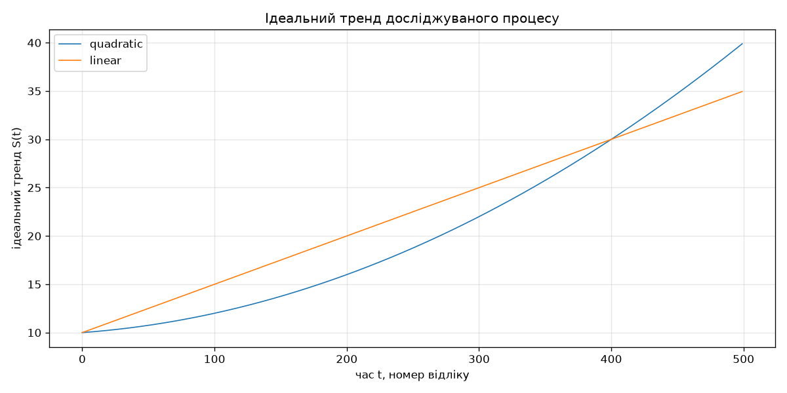

Рисунок 5 – Ідеальний тренд досліджуваного процесу

### Етап 3. Адитивна модель статистичної вибірки

Таблиця 4 – Характеристики адитивних вибірок

| Комбінація | $M$ | $D$ | СКВ |
| --- | --- | --- | --- |
| квадратичний + нормальний | 20,7377 | 102,1702 | 10,1079 |
| квадратичний + експоненційний | 25,9257 | 102,6843 | 10,1333 |
| лінійний + нормальний | 22,4094 | 76,0249 | 8,7192 |
| лінійний + експоненційний | 27,5974 | 77,2766 | 8,7907 |

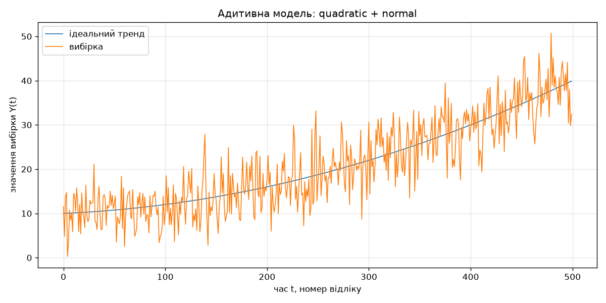

Рисунок 6 – Адитивна модель: квадратичний тренд + нормальна похибка

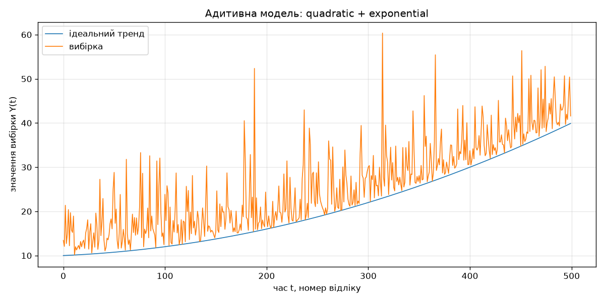

Рисунок 7 – Адитивна модель: квадратичний тренд + експоненційна похибка

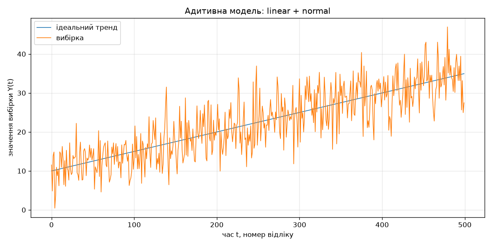

Рисунок 8 – Адитивна модель: лінійний тренд + нормальна похибка

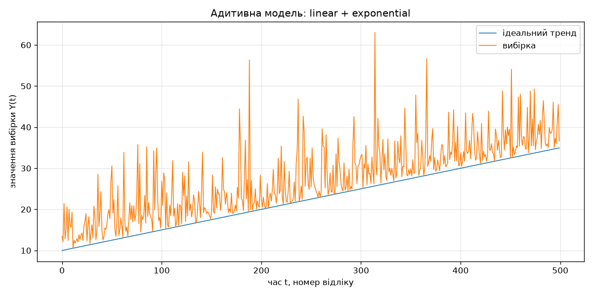

Рисунок 9 – Адитивна модель: лінійний тренд + експоненційна похибка

### Етап 4. Статистичні характеристики вибірок

Тренд виділено за МНК поліномом відповідного степеня, характеристики розраховано за залишком.

Таблиця 5 – Характеристики вибірок після виділення тренду за МНК

| Комбінація | $D$ вибірки | $D$ похибки (МНК) | $D$ похибки теоретично | $R^2$ |
| --- | --- | --- | --- | --- |
| квадратичний + нормальний | 102,1702 | 22,9840 | 25,0000 | 0,775042 |
| квадратичний + експоненційний | 102,6843 | 28,0748 | 25,0000 | 0,726591 |
| лінійний + нормальний | 76,0249 | 22,9864 | 25,0000 | 0,697646 |
| лінійний + експоненційний | 77,2766 | 28,0765 | 25,0000 | 0,636675 |

Математичне сподівання залишку в усіх випадках дорівнює нулю з точністю до похибки
обчислень – систематична складова повністю виділена.

Гістограми вибірок, сформованих у п. 3. Для вибірки з трендом закон розподілу не
проглядається, тому поруч наведено гістограму похибки, виділеної з тієї самої вибірки
за МНК: вона відновлює вихідний закон.

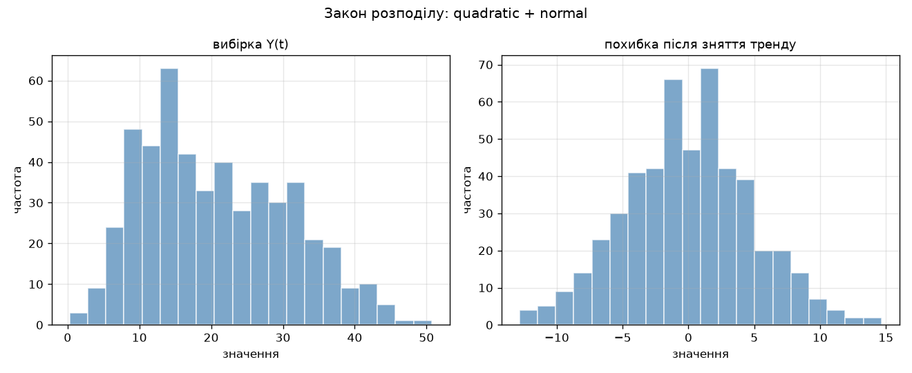

Рисунок 10 – Закон розподілу вибірки та її похибки: квадратичний тренд, нормальна похибка

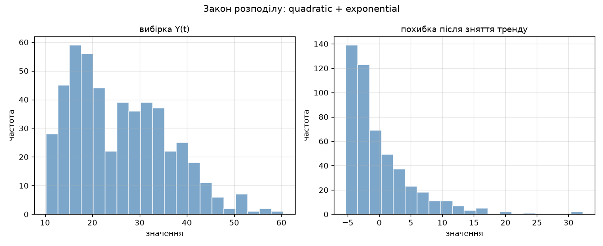

Рисунок 11 – Закон розподілу вибірки та її похибки: квадратичний тренд, експоненційна похибка

### Аномальні виміри

Таблиця 6 – Вплив аномальних вимірів на характеристики вибірки

| Вибірка | $M$ | $D$ | СКВ |
| --- | --- | --- | --- |
| квадратичний + нормальний, без АВ | 20,7377 | 102,1702 | 10,1079 |
| те саме, 10 % АВ з $Q = 3$ | 21,1746 | 178,1225 | 13,3463 |

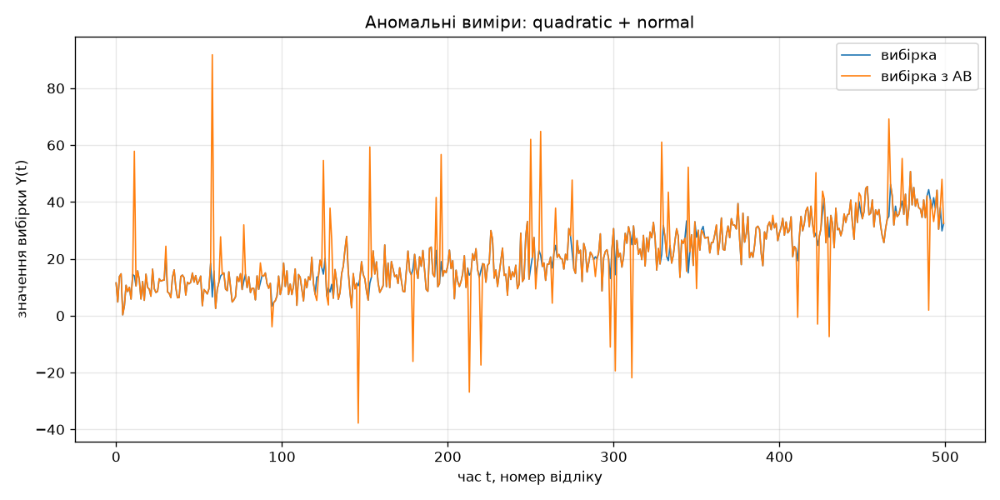

Рисунок 12 – Вплив аномальних вимірів на вибірку

Внесення 10 % аномальних вимірів збільшило дисперсію вибірки на 74 % практично без
зміщення математичного сподівання.

### Етап 5. Статистичні характеристики реальних даних

Файл `Oschadbank (USD).xls` містить 348 відліків курсу долара за період 08.02.2022 –
06.02.2023 за трьома показниками: `Купівля`, `Продаж`, `КурсНбу`.

Виявлена особливість даних. У показниках `Продаж` і `КурсНбу` частина відліків
дорівнює нулю: починаючи з 24.02.2022 банк певний час не котирував валюту. Нуль тут –
не значення курсу, а закодований пропуск. Без обробки такі пропуски різко спотворюють
характеристики. Пропуски заповнено лінійною інтерполяцією сусідніх відліків.

Таблиця 7 – Вплив заповнення пропусків на реальні дані

| Показник | Пропусків | $D$ до обробки | $D$ після обробки | $R^2$ до | $R^2$ після |
| --- | --- | --- | --- | --- | --- |
| Купівля | 0 | 19,0798 | 19,0798 | 0,948156 | 0,948156 |
| Продаж | 39 | 156,4326 | 16,1941 | 0,591538 | 0,947958 |
| КурсНбу | 41 | 124,9770 | 13,6662 | 0,010316 | 0,773185 |

Характеристики після заповнення пропусків:

Таблиця 8 – Характеристики реальних даних після обробки

| Показник | $M$ | $D$ | СКВ | $D$ похибки (МНК) | $R^2$ |
| --- | --- | --- | --- | --- | --- |
| Купівля | 36,4808 | 19,0798 | 4,3680 | 0,9892 | 0,948156 |
| Продаж | 37,3852 | 16,1941 | 4,0242 | 0,8428 | 0,947958 |
| КурсНбу | 33,2226 | 13,6662 | 3,6968 | 3,0997 | 0,773185 |

Відновлені за МНК тренди, де $t$ – номер відліку:

$$S_{\text{куп}}(t) = -1{,}764\cdot10^{-4}\,t^2 + 0{,}1005\,t + 26{,}1390$$

$$S_{\text{прод}}(t) = -1{,}605\cdot10^{-4}\,t^2 + 0{,}0919\,t + 27{,}8866$$

$$S_{\text{НБУ}}(t) = -5{,}398\cdot10^{-5}\,t^2 + 0{,}0507\,t + 26{,}5918$$

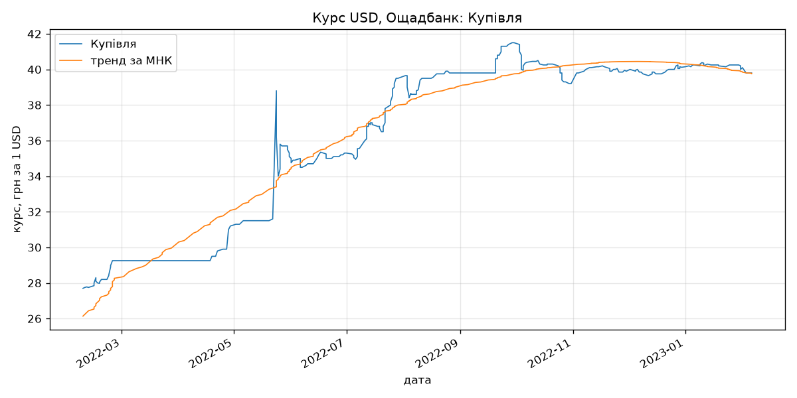

Рисунок 13 – Курс USD, Ощадбанк: Купівля, та виділений тренд за МНК

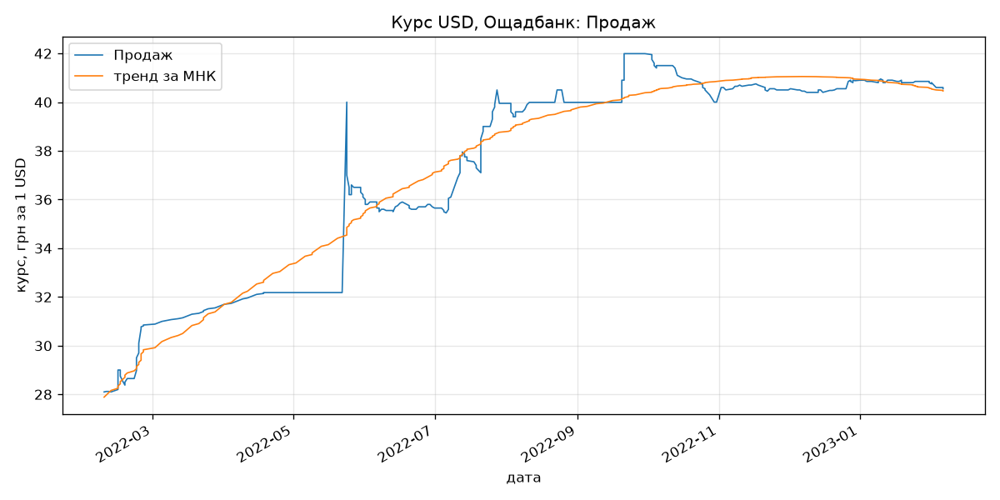

Рисунок 14 – Курс USD, Ощадбанк: Продаж, та виділений тренд за МНК

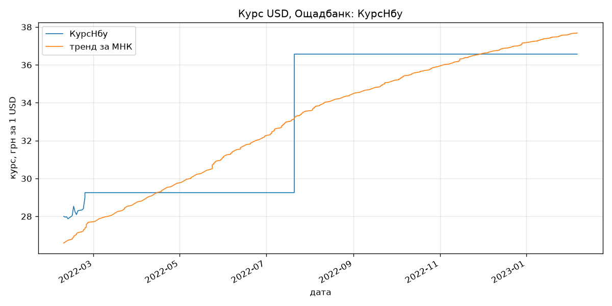

Рисунок 15 – Курс USD, Ощадбанк: КурсНбу, та виділений тренд за МНК

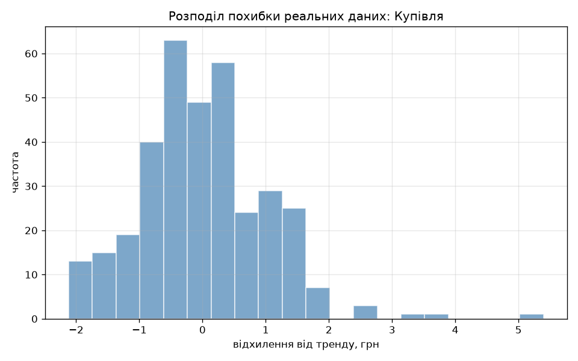

Рисунок 16 – Розподіл похибки реальних даних (Купівля) після зняття тренду

Реальні дані відрізняються від синтетичних принципово: похибка не є білим шумом,
залишок автокорельований (курс змінюється ступінчасто і зберігає рівень тижнями).
Для показника `КурсНбу` квадратичний тренд описує дані гірше ($R^2 = 0{,}77$), оскільки
ряд має характер східчастої функції з різким стрибком у липні 2022 року.

## 3.5. Завдання III рівня: парсинг сайту та синтез подібної моделі

Джерело даних: світові річні викиди CO$_2$,
`https://www.worldometers.info/co2-emissions/co2-emissions-by-year/`. Ресурс
`worldometers.info` входить до переліку джерел даних, наведеного в завданні. Сторінка
містить статичну HTML-таблицю з колонками `Year`, `CO2 emissions (tons)`,
`1 Year Change`, `Per Capita`.

Архів курсу Ощадбанку, згаданий у завданні, для парсингу непридатний: без JavaScript
сторінка віддає 212 байт без жодної таблиці.

Процедура парсингу: завантаження сторінки через `requests` із заданим `User-Agent`;
пошук таблиці засобами `beautifulsoup4`; відбір рядків, перша комірка яких є чотиризначним
роком; перетворення чисел з роздільником тисяч (`39,632,664,219`) у числовий тип;
сортування за роком за зростанням.

Результат парсингу збережено у файл `assets/07_parsed.csv` (колонки `Рік`, `Викиди`,
`НаДушу`). Отримано 55 записів за період 1970–2024 років без пропусків. Для аналізу ряд
переведено в мільярди тонн.

Динаміка тренду. Тренд відновлено за МНК поліномом другого степеня ($t$ – номер року
від 1970):

$$S(t) = 4{,}388\cdot10^{-3}\,t^2 + 0{,}2262\,t + 16{,}1954$$

де $t$ – номер року у ряді, $t = 0$ відповідає 1970 року.

Додатні коефіцієнти при $t$ і $t^2$ означають зростання викидів із прискоренням:
щорічний приріст не сталий, а сам зростає. Достовірність апроксимації
$R^2 = 0{,}9799$ – квадратична модель пояснює 98 % варіації ряду.

Статистичні характеристики результатів парсингу:

Таблиця 9 – Характеристики результатів парсингу та синтезованої моделі

| Ряд | $M$ | $D$ | СКВ |
| --- | --- | --- | --- |
| реальні дані, млрд тонн | 26,6080 | 56,1709 | 7,4947 |
| похибка після зняття тренду (МНК) | 0,0000 | 1,1309 | 1,0634 |
| синтезована модель | 26,5409 | 55,8972 | 7,4764 |

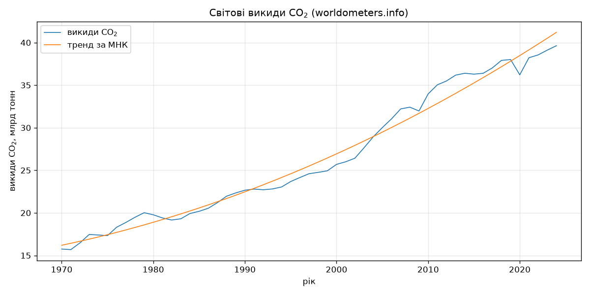

Рисунок 17 – Світові викиди CO$_2$ за результатами парсингу та виділений тренд за МНК

Виявлена аномалія. Програма визначає відлік із найбільшим відхиленням униз від тренду.
Ним виявився 2020 рік із відхиленням $-2{,}267$ млрд тонн – це наслідок карантинних
обмежень через пандемію COVID-19. На рисунку 17 провал чітко видно, а наступного року ряд
повертається до тренду. Це приклад аномального виміру в реальних даних, аналогічний
штучно внесеним аномаліям п. 3.4, але зумовлений реальною зовнішньою подією.

Синтез моделі. За реальними даними синтезовано модель за тією ж адитивною схемою:
тренд узято з МНК-апроксимації реальних даних, похибку згенеровано за нормальним законом
з математичним сподіванням і СКВ, що дорівнюють характеристикам реального залишку.

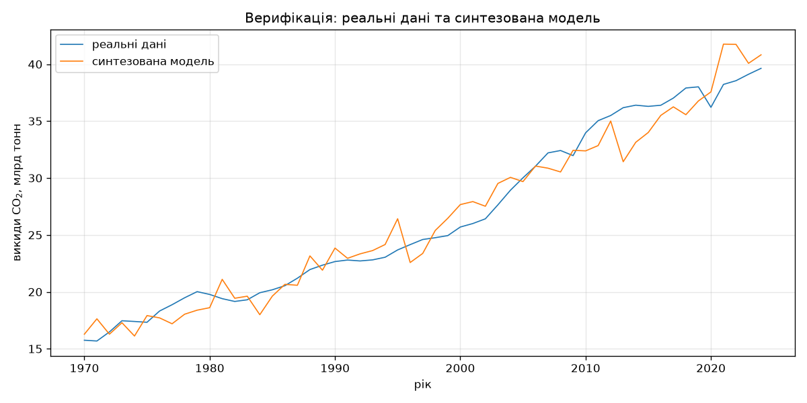

Рисунок 18 – Реальні дані та синтезована модель

## 3.6. Програмний код

Нижче наведено фрагменти, що безпосередньо реалізують математичні моделі розділу 3.1.
Повний код проекту додається до звіту окремим архівом.

Генерація випадкової величини за законами розподілу варіанта 8 та побудова ідеального
тренду:

```python
def normal(rng: Generator, size: int, mean: float, std: float) -> Sample:
    """Нормальний закон розподілу. M = mean, D = std**2."""
    return rng.normal(mean, std, size)


def exponential(rng: Generator, size: int, scale: float) -> Sample:
    """Експоненційний закон розподілу. M = scale, D = scale**2."""
    return rng.exponential(scale, size)


def linear(size: int, intercept: float, slope: float) -> Series:
    """Лінійний тренд: S(t) = intercept + slope * t."""
    return intercept + slope * _time(size)


def quadratic(size: int, a: float, b: float, c: float) -> Series:
    """Квадратичний тренд: S(t) = a * t**2 + b * t + c."""
    t = _time(size)
    return a * t**2 + b * t + c
```

Адитивна модель вибірки та числові характеристики:

```python
def additive(trend: Series, noise: Series) -> Series:
    """Тренд плюс похибка."""
    return trend + noise


def describe(sample: Series) -> Stats:
    """Математичне сподівання, дисперсія та середньоквадратичне відхилення."""
    variance = float(np.var(sample))
    return Stats(mean=float(np.mean(sample)), variance=variance,
                 std=float(np.sqrt(variance)))
```

Виділення тренду за методом найменших квадратів і достовірність апроксимації. Матриця
плану будується функцією `np.vander`, система нормальних рівнянь розв'язується без явного
обертання матриці:

```python
def mnk_fit(series: Series, degree: int = 2) -> tuple[Series, Series]:
    """Згладжування за МНК: C = (F^T F)^-1 F^T Y."""
    t = np.arange(len(series), dtype=float)
    f = np.vander(t, degree + 1, increasing=True)
    coeffs = np.linalg.solve(f.T @ f, f.T @ series)
    return f @ coeffs, coeffs


def r_squared(actual: Series, fitted: Series) -> float:
    """Достовірність апроксимації R**2."""
    residual = float(np.sum((actual - fitted) ** 2))
    total = float(np.sum((actual - np.mean(actual)) ** 2))
    return 1.0 - residual / total
```

Заповнення пропусків у реальних даних лінійною інтерполяцією сусідніх відліків:

```python
def fill_gaps(series: Series, *, missing: float = 0.0) -> tuple[Series, int]:
    """Повертає очищений ряд і кількість заповнених відліків."""
    values = series.copy()
    gaps = values == missing
    count = int(gaps.sum())
    if count and not gaps.all():
        index = np.arange(len(values), dtype=float)
        values[gaps] = np.interp(index[gaps], index[~gaps], values[~gaps])
    return values, count
```

Синтез моделі, подібної реальним даним за трендом і статистичними характеристиками
(завдання III рівня):

```python
def like(real: Series, rng: Generator, degree: int = 2) -> Synthetic:
    """Вибірка з тим самим трендом і тими ж характеристиками похибки."""
    trend, coeffs = stats.mnk_fit(real, degree)
    residual = stats.detrended(real, trend)
    noise = rng.normal(float(np.mean(residual)), float(np.std(residual)), len(real))
    return Synthetic(series=trend + noise, trend=trend,
                     residual=residual, coeffs=coeffs)
```

## 3.7. Аналіз результатів та верифікація

Задані та обраховані характеристики випадкової величини збігаються в межах статистичної
похибки за $n = 500$: для нормального закону задано $M = 0$, $D = 25$, отримано
$M = -0{,}0656$, $D = 22{,}99$; для експоненційного задано $M = 5$, $D = 25$, отримано
$M = 5{,}12$, $D = 28{,}12$. Форма гістограм (рисунки 3, 4) відповідає теоретичним
щільностям розподілу.

Модель тренду перевірено аналітично: $S(499) = 10 + 0{,}01 \cdot 499 +
0{,}0001 \cdot 499^2 = 39{,}8901$, що збігається з розрахованим значенням.

Головний результат верифікації стосується методики виділення тренду. Після зняття тренду
за МНК математичне сподівання залишку дорівнює нулю, а його дисперсія (22,98 для
нормальної похибки, 28,07 для експоненційної) збігається з дисперсією похибки,
згенерованої на етапі 1 (22,99 та 28,12). Отже, тренд виділяється повністю і не спотворює
характеристик випадкової складової.

Експоненційна похибка зміщує вибірку на $\lambda = 5$ відносно нормальної (25,93 проти
20,74 для квадратичного тренду), що відповідає теоретичному $M[x] = \lambda$. Це
зміщення поглинається вільним членом полінома МНК і на характеристики залишку не впливає.

Аномальні виміри збільшили дисперсію вибірки зі 102,17 до 178,12 за майже незмінного
математичного сподівання, тобто спотворюють саме оцінку розсіювання.

Реальні дані потребують попередньої підготовки: пропуски, закодовані нулем, завищували
дисперсію показника `Продаж` майже вдесятеро (156,43 проти 16,19) і знижували $R^2$ з
0,948 до 0,592.

Синтезована за реальними даними модель відтворює їх дисперсію з відхиленням 0,5 % і
математичне сподівання з відхиленням 0,25 %. Проте вона не відтворює структуру ряду:
реальні дані автокорельовані, а синтезований шум – ні (рисунок 18). Це очікуване
обмеження адитивної моделі з білим шумом.

Отримані результати не суперечать теоретичним положенням, усі етапи завдання III рівня
складності виконані у повному обсязі.

# IV. Висновки

Розроблено програмний скрипт мовою Python, що забезпечує отримання та підготовку часових
рядів: генерацію випадкових величин за заданими законами розподілу, моделювання
ідеального тренду, синтез адитивної моделі вибірки, визначення числових характеристик
та їх візуалізацію.

1. Синтезовано та верифіковано моделі випадкової величини за нормальним і експоненційним
   законами; обраховані характеристики збігаються з теоретичними.
2. Реалізовано квадратичний і лінійний тренди та адитивну модель за чотирма комбінаціями
   похибка / тренд.
3. Показано, що характеристики випадкової складової коректно визначаються лише після
   виділення тренду за МНК з оцінкою достовірності апроксимації $R^2$.
4. На реальних даних курсу USD виявлено та оброблено пропуски, закодовані нулем, що
   підвищило $R^2$ показника `Продаж` з 0,592 до 0,948.
5. Виконано парсинг сайту зі світовими викидами CO$_2$ за 1970–2024 роки, збережено
   результат у файл, оцінено динаміку тренду ($R^2 = 0{,}98$) та синтезовано подібну
   модель. Автоматично виявлено аномалію 2020 року, зумовлену пандемією COVID-19.

Синтезовані дані придатні для тестування алгоритмів обробки часових рядів. Водночас
показано обмеження адитивної моделі з білим шумом: вона відтворює числові характеристики
реальних даних, але не їх автокореляційну структуру.
