# І. Мета

Виявити, дослідити та узагальнити особливості реалізації процесів статистичного навчання
із застосуванням методів обробки Big Data масивів з використанням можливостей мови
програмування Python.

# ІІ. Завдання

Розробити програмний скрипт мовою Python, що реалізує функціонал статистичного навчання
за Big Data Time Series для універсальної платформи обробки статистичних даних.

Група вимог 1:

1. Отримання вхідних даних із властивостями, заданими в ЛР 1.
2. Визначення показників якості та оптимізація моделі: вибір моделі залежно від значення
   показника якості. Показник і спосіб оптимізації обрати самостійно.
3. Статистичне навчання поліноміальної моделі за методом найменших квадратів
   (поліноміальна регресія). Спосіб реалізації МНК обрати самостійно.
4. Прогнозування (екстраполяція) параметрів досліджуваного процесу за навченою моделлю
   на 0,5 інтервалу спостереження.
5. Аналіз отриманих результатів та верифікація розробленого скрипта.

Група вимог 2:

1. Модель вхідних даних із аномальними вимірами.
2. Очищення вхідних даних від аномальних вимірів. Спосіб виявлення та очищення обрати
   самостійно.

Група вимог 3:

1. Розробка власного алгоритму виявлення аномальних вимірів та навчання його параметрів
   бачити властивості вибірки.

Обраний рівень складності – III: реалізовано всі три групи вимог, максимальна оцінка
15 балів.

Умови варіанта 8 успадковані з ЛР 1: похибка за нормальним законом, квадратичний тренд,
реальні дані – курс USD за даними Ощадбанку.

# ІІІ. Результати виконання лабораторної роботи

## 3.1. Синтезована математична модель

### 3.1.1. Модель вхідних даних

Вхідні дані – адитивна суміш невипадкової та стохастичної складових, як у ЛР 1:

$$Y(t) = S(t) + \varepsilon(t), \quad t = 0, 1, \ldots, n-1$$

Ідеальний тренд – квадратичний:

$$S(t) = a t^2 + b t + c, \quad a = 10^{-4},\ b = 10^{-2},\ c = 10$$

Похибка вимірювання – нормальний закон з нульовим математичним сподіванням:

$$\varepsilon(t) \sim N(0, \sigma^2), \quad \sigma = 5$$

Обсяг вибірки $n = 10\,000$ відліків, що відповідає постановці задачі обробки Big Data.

### 3.1.2. Модель аномального виміру

Аномальний вимір – адитивний викид, що зміщує окремий відлік на величину, свідомо більшу
за розкид похибки вимірювання:

$$Y_{AV}(t_j) = Y(t_j) + s_j \cdot (q + |\xi_j|) \cdot \sigma, \quad s_j \in \{-1, +1\},\ \xi_j \sim N(0, 1)$$

де $q = 5$ – коефіцієнт переважання аномалії над похибкою; $s_j$ – випадковий знак зсуву.
Номери $t_j$ розподілені рівномірно, частка аномальних вимірів – 10 % обсягу вибірки.

Модель, у якій аномалія – це просто похибка зі збільшеним у $q$ разів СКВ, тут не
використовується: більшість згенерованих таким чином відліків потрапляє всередину розкиду
звичайного шуму, тобто є аномаліями за походженням, але не за значенням, і жоден детектор
принципово не здатен їх відрізнити.

### 3.1.3. Виявлення аномальних вимірів

Обидва детектори працюють із залишком після ковзної медіани ширини $w$:

$$r(t) = Y(t) - \operatorname{med}\{Y(t - \lfloor w/2 \rfloor), \ldots, Y(t + \lfloor w/2 \rfloor)\}$$

Медіана, на відміну від ковзного середнього, сама по собі стійка до викидів, тому тренд
знімається без спотворення сусідніх відліків.

Базовий детектор – той, що наводиться в методичці: ширина вікна $w = 5$ і поріг $3\sigma$
задаються наперед, розсіювання оцінюється звичайним СКВ залишку:

$$|r(t)| > 3 \hat\sigma, \quad \hat\sigma = \sqrt{\frac{1}{n}\sum_t (r(t) - \bar r)^2}$$

Власний адаптивний детектор описано в п. 3.5.

Виявлені відліки не відкидаються, а замінюються лінійною інтерполяцією найближчих
невідмічених сусідів – так зберігається рівномірність кроку за часом, потрібна
для подальшої побудови матриці плану.

### 3.1.4. Поліноміальна модель і метод найменших квадратів

Навчана модель – поліном степеня $m$ від нормованого часу $\tau = t / n$:

$$\hat{Y}(\tau) = c_0 + c_1 \tau + c_2 \tau^2 + \ldots + c_m \tau^m$$

У матричному вигляді $\hat{Y} = F C$, де $F$ – матриця плану Вандермонда:

$$F = \begin{pmatrix} 1 & \tau_0 & \tau_0^2 & \cdots & \tau_0^m \\ 1 & \tau_1 & \tau_1^2 & \cdots & \tau_1^m \\ \vdots & \vdots & \vdots & \ddots & \vdots \\ 1 & \tau_{n-1} & \tau_{n-1}^2 & \cdots & \tau_{n-1}^m \end{pmatrix}$$

Оцінка коефіцієнтів за методом найменших квадратів отримується з умови мінімуму суми
квадратів залишків і має замкнену форму:

$$C = (F^T F)^{-1} F^T Y$$

Нормування часу принципове саме для Big Data: без нього при $n = 10^4$ і $m = 4$ елементи
матриці $F^T F$ сягають $10^{33}$, матриця стає виродженою в межах подвійної точності
й розв'язок втрачає сенс. Коефіцієнти при натуральному часі відновлюються як
$c_i^{(t)} = c_i / n^i$.

### 3.1.5. Показники якості та вибір моделі

Якість навчання оцінюється чотирма показниками:

$$R^2 = 1 - \frac{\sum_t (Y(t) - \hat{Y}(t))^2}{\sum_t (Y(t) - \bar{Y})^2}, \qquad \text{MAE} = \frac{1}{n}\sum_t |Y(t) - \hat{Y}(t)|$$

$$\text{MSE} = \frac{1}{n}\sum_t (Y(t) - \hat{Y}(t))^2, \qquad \text{RMSE} = \sqrt{\text{MSE}}$$

Степінь полінома не можна обирати за значенням цих показників на всій вибірці: вони
монотонно поліпшуються зі зростанням $m$, і модель зрештою описує не тренд, а шум.
Тому застосовано перевірку на відкладеному хвості: модель навчається на перших
$0{,}8n$ відліках, а порівняння йде за RMSE прогнозу на останніх $0{,}2n$, яких модель
не бачила. Обирається степінь із найменшою помилкою прогнозу.

### 3.1.6. Модель екстраполяції

Прогноз будується підстановкою в навчену модель значень часу за межами інтервалу
спостереження:

$$\hat{Y}(t) = \sum_{i=0}^{m} c_i \left(\frac{t}{n}\right)^i, \quad t = n, \ldots, n + \lceil 0{,}5 n \rceil$$

Коефіцієнт прогнозування 0,5 – співвідношення інтервалу прогнозування до інтервалу
спостереження, задане умовою завдання.

## 3.2. Блок-схема алгоритму та її опис

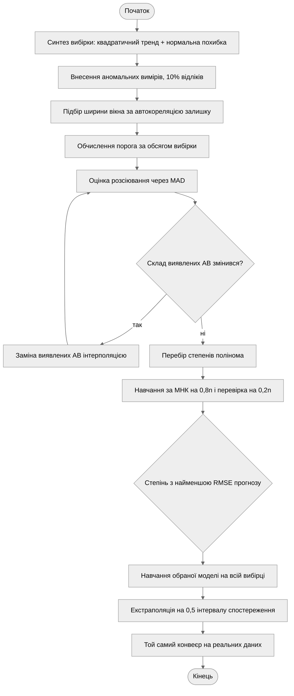

Рисунок 1 – Блок-схема алгоритму програми

Алгоритм складається з трьох послідовних частин. Перша готує вхідні дані: синтезує
адитивну модель і вносить у неї аномальні виміри з відомими номерами, що далі дає змогу
об'єктивно оцінити якість виявлення.

Друга частина – цикл виявлення аномальних вимірів. Спочатку з даних виводяться параметри
детектора: ширина вікна та поріг. Далі йде ітеративне уточнення: за поточною оцінкою
розсіювання відмічаються викиди, відмічені відліки замінюються інтерполяцією, і оцінка
перераховується вже за очищеними даними. Цикл завершується, коли склад виявлених
аномалій перестає змінюватися.

Третя частина – статистичне навчання. Степені полінома перебираються, для кожного модель
навчається на початковій частині вибірки й перевіряється на відкладеному хвості; модель
з найменшою помилкою прогнозу навчається повторно на всій вибірці й використовується
для екстраполяції. Той самий конвеєр застосовується до реальних даних.

## 3.3. Опис структури проекту програми

```
project/
├── justfile            рецепти запуску та збірки звіту
├── pyproject.toml      залежності лабораторної роботи
├── out/                графіки, які генерує програма
└── src/
    ├── main.py         точка входу: етапи роботи та побудова графіків
    ├── series.py       вхідні дані: тренд, похибка, аномальні виміри, реальні дані
    ├── detect.py       виявлення та очищення аномальних вимірів
    └── learn.py        МНК, показники якості, вибір степеня, екстраполяція
```

Рисунок 2 – Структура проекту

Використані бібліотеки: `numpy` – матричні обчислення, ковзні вікна та розв'язання системи
МНК; `scipy` – квантиль нормального розподілу для обчислення порога; `scikit-learn` –
показники якості; `pandas` разом з `xlrd` – читання реальних даних з `.xls`;
`matplotlib` – візуалізація.

## 3.4. Результати роботи програми

Усі результати отримано за `seed = 42` і відтворюються при повторному запуску.

### Етап 1. Синтез вхідних даних

Таблиця 1 – Параметри моделі вхідних даних

| Параметр | Значення |
| --- | --- |
| Обсяг вибірки $n$ | 10 000 |
| Тренд | $10^{-4} t^2 + 10^{-2} t + 10$ |
| Похибка | $N(0;\ 5^2)$ |
| Частка аномальних вимірів | 10 % (1000 відліків) |
| Мінімальний зсув аномалії | $5\sigma = 25$ |

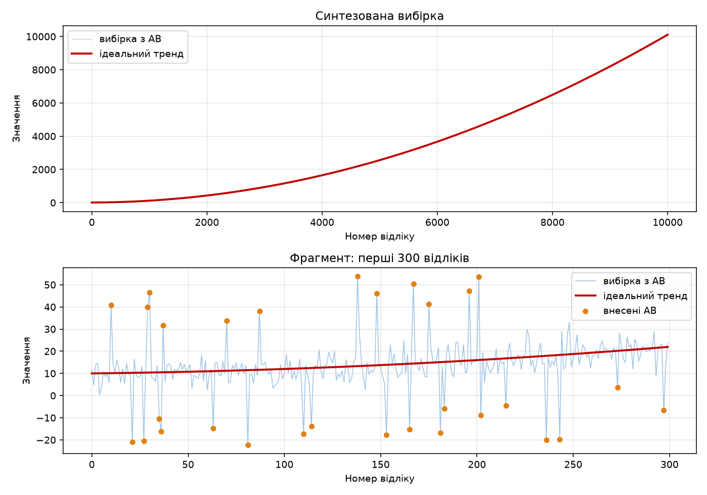

Рисунок 3 – Синтезована вибірка та її фрагмент з аномальними вимірами

На повному графіку при $n = 10\,000$ ані похибка, ані окремі аномалії не розрізняються:
розкид ±25 одиниць губиться на тлі тренду, що змінюється від 10 до 10 000. Тому поруч
наведено фрагмент з перших 300 відліків, на якому видно і шум, і внесені викиди.

### Етап 2. Виявлення та очищення аномальних вимірів

Адаптивний детектор вивів з даних ширину вікна $w = 41$ і поріг $4{,}56\sigma$.

Таблиця 2 – Результати виявлення на забрудненій вибірці, усього внесено 1000 АВ

| Детектор | Виявлено | Хибних спрацювань | Пропущено |
| --- | --- | --- | --- |
| фіксований, вікно 5, поріг $3\sigma$ | 334 | 0 | 666 |
| адаптивний | 727 | 0 | 273 |

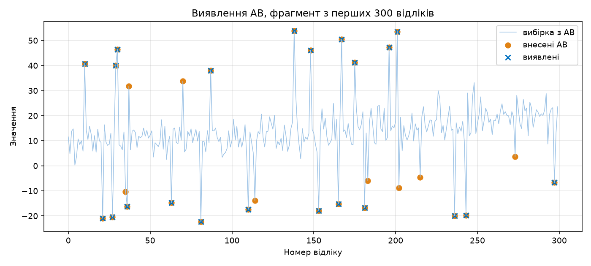

Рисунок 4 – Виявлення аномальних вимірів на фрагменті вибірки

Адаптивний детектор знаходить у 2,2 раза більше справжніх викидів за жодного хибного
спрацювання. Причина відставання базового детектора – маскування: він оцінює розсіювання
звичайним СКВ по забруднених даних, і самі аномалії завищують цю оцінку, піднімаючи поріг.

Пропущені 273 аномалії – це викиди, що потрапили в зону біля порога: зсув 25–28 одиниць
частково компенсується власною похибкою відліку протилежного знаку, і сумарне відхилення
не досягає порогового значення 22,8. На рисунку 4 такі відліки позначені маркером
внесеної аномалії без хрестика виявлення.

### Етап 3. Вибір степеня моделі

Таблиця 3 – Вибір степеня полінома за помилкою прогнозу, синтезована вибірка

| Степінь $m$ | RMSE на навчальній частині | RMSE на відкладеному хвості |
| --- | --- | --- |
| 1 | 476,884 | 2081,713 |
| 2 | 6,133 | 6,459 |
| 3 | 6,133 | 6,532 |
| 4 | 6,133 | 6,522 |
| 5 | 6,133 | 6,826 |

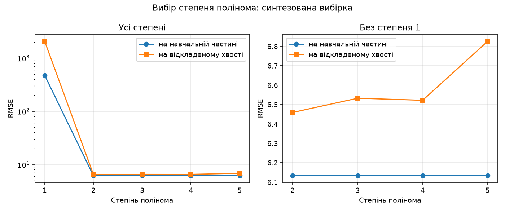

Рисунок 5 – Помилка навчання та помилка прогнозу залежно від степеня полінома

Обрано степінь 2, що збігається зі степенем ідеального тренду. Показник на навчальній
частині починаючи з $m = 2$ не змінюється в межах трьох знаків, тобто сам по собі не дає
підстав зупинитися; вибір робить саме помилка прогнозу, яка від $m = 2$ зростає.

### Етап 4. Навчання та екстраполяція

Таблиця 4 – Показники якості навченої моделі, синтезована вибірка

| Показник | Значення |
| --- | --- |
| $R^2$ | 1,0000 |
| MAE | 4,4373 |
| MSE | 38,3689 |
| RMSE | 6,1943 |

Відновлені коефіцієнти при натуральному часі: $c_0 = 9{,}55$, $c_1 = 1{,}019 \cdot 10^{-2}$,
$c_2 = 9{,}998 \cdot 10^{-5}$ проти закладених $10$, $10^{-2}$ і $10^{-4}$ відповідно.

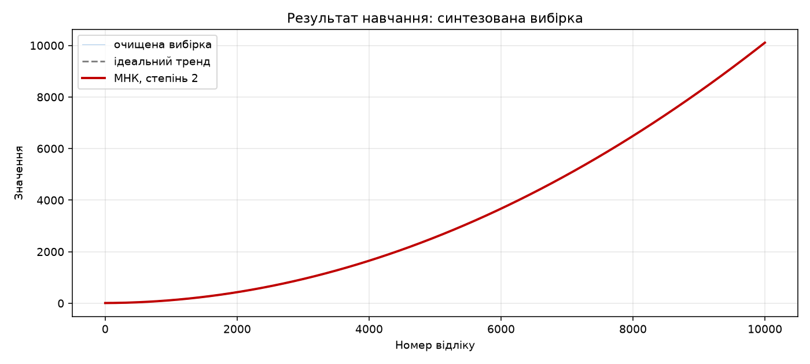

Рисунок 6 – Навчена модель і закладений ідеальний тренд

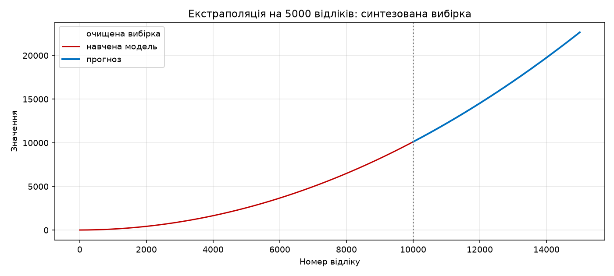

Рисунок 7 – Екстраполяція на 5000 відліків за межі інтервалу спостереження

Навчена крива візуально збігається з ідеальним трендом, RMSE 6,19 близька до СКВ
похибки 5 – тобто модель пояснює все, крім самого шуму.

### Етап 5. Реальні дані

Реальні дані – курс USD за даними Ощадбанку, 348 відліків. Нульових значень у стовпці
`Купівля` немає, заповнення пропусків не знадобилося.

Адаптивний детектор вивів ширину вікна $w = 3$ і поріг $3{,}80\sigma$, виявивши
34 аномальні виміри.

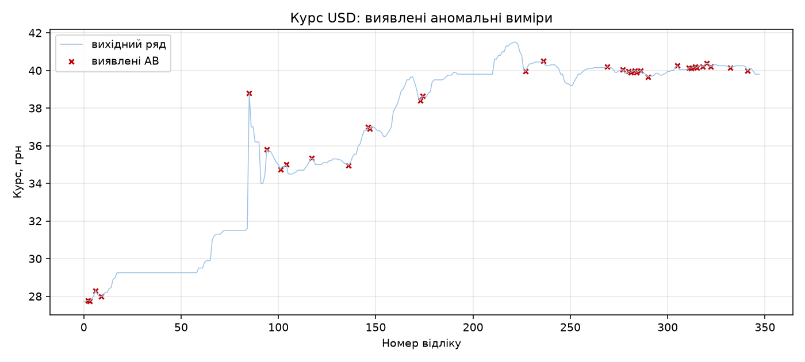

Рисунок 8 – Курс USD: виявлені аномальні виміри

Таблиця 5 – Вибір степеня полінома за помилкою прогнозу, курс USD

| Степінь $m$ | RMSE на навчальній частині | RMSE на відкладеному хвості |
| --- | --- | --- |
| 1 | 1,371 | 4,792 |
| 2 | 1,033 | 0,919 |
| 3 | 0,846 | 4,866 |
| 4 | 0,841 | 2,948 |
| 5 | 0,840 | 4,960 |

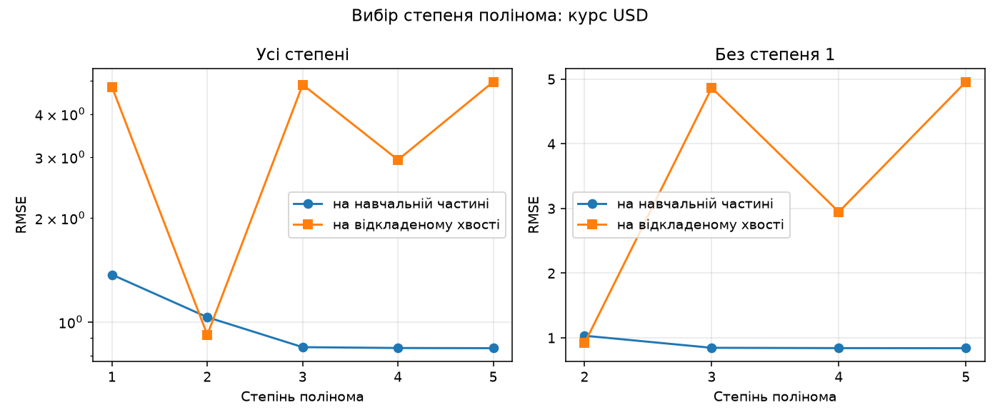

Рисунок 9 – Вибір степеня полінома для курсу USD

Таблиця 6 – Показники якості навченої моделі, курс USD

| Показник | Значення |
| --- | --- |
| $R^2$ | 0,9529 |
| MAE | 0,7556 |
| MSE | 0,9000 |
| RMSE | 0,9487 |

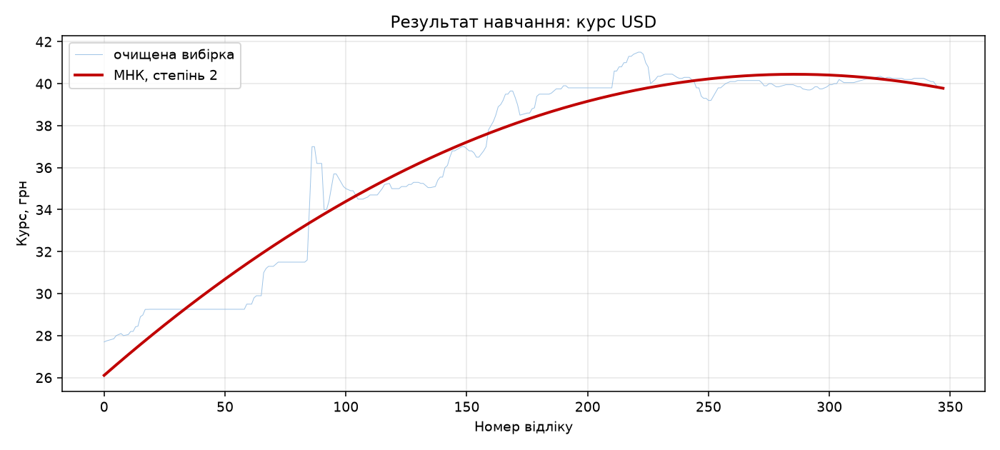

Рисунок 10 – Навчена модель для курсу USD

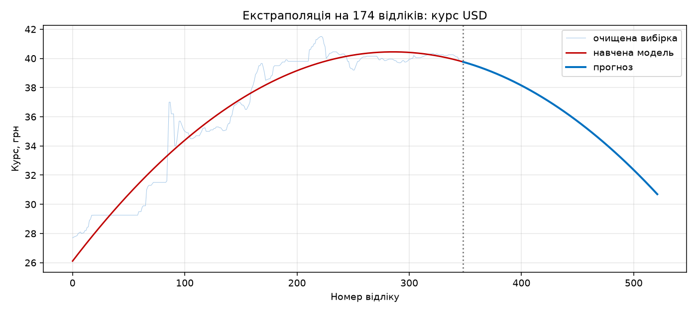

Рисунок 11 – Екстраполяція курсу USD на 174 відліки

На реальних даних розрив між показниками добре видно: степені 3–5 дають меншу помилку
на навчальній частині, але помилка прогнозу в них у 3–5 разів більша, ніж у степеня 2.
Це класична картина перенавчання, і саме її не видно, якщо оцінювати модель лише
за $R^2$ на всій вибірці.

## 3.5. Завдання III рівня: власний алгоритм виявлення аномальних вимірів

### 3.5.1. Недоліки базового алгоритму

Базовий детектор має два фіксовані параметри, і обидва не витримують переходу до Big Data.

Поріг $3\sigma$ не залежить від обсягу вибірки. Для нормального закону за межі трьох
СКВ виходить 0,27 % відліків, тому на чистих даних без жодної аномалії детектор
спрацьовує $0{,}0027n$ разів: один раз при $n = 370$ і близько 27 разів при $n = 10\,000$.
Зі зростанням обсягу вибірки кількість хибних спрацювань зростає лінійно, а зміст
порога втрачається.

Розсіювання оцінюється звичайним СКВ по забруднених даних. Кожна аномалія входить
у суму квадратів зі своєю вагою і завищує оцінку $\hat\sigma$, піднімаючи поріг. Це
ефект маскування: чим більше в даних викидів, тим менше з них детектор бачить.

### 3.5.2. Запропонований алгоритм

Замість двох фіксованих чисел усі параметри виводяться з властивостей самої вибірки.

Розсіювання оцінюється через медіанне абсолютне відхилення:

$$\hat\sigma_{MAD} = 1{,}4826 \cdot \operatorname{med}_t \left| r(t) - \operatorname{med} r \right|$$

Множник 1,4826 переводить MAD у СКВ для нормального закону. Медіана не реагує на значення
окремих викидів, тому оцінка не завищується самими аномаліями.

Поріг виводиться з обсягу вибірки за поправкою Бонферроні. Умова «очікувана кількість
хибних спрацювань на всій вибірці не перевищує $\alpha$» дає:

$$k(n) = \Phi^{-1}\!\left(1 - \frac{\alpha}{2n}\right)$$

При $\alpha = 0{,}05$ це $k = 3{,}89$ для $n = 500$ і $k = 4{,}56$ для $n = 10\,000$.
Поріг зростає з обсягом вибірки рівно настільки, щоб кількість хибних спрацювань
залишалася сталою.

Ширина вікна підбирається за автокореляцією залишку на лагу 1:

$$\rho_1 = \frac{\sum_t (r(t) - \bar r)(r(t+1) - \bar r)}{\sum_t (r(t) - \bar r)^2}
\ \longrightarrow\ \min_w |\rho_1|$$

Поки вікно завузьке, ковзна медіана не встигає зняти тренд, його залишок переходить
у $r(t)$ і сусідні значення виявляються корельованими. Щойно тренд знято повністю,
залишок стає білим шумом і $\rho_1$ прямує до нуля. Кандидати – непарні ширини
3, 5, 9, 15, 25, 41.

Оцінка розсіювання уточнюється ітеративно: виявлені викиди замінюються інтерполяцією,
$\hat\sigma_{MAD}$ перераховується за очищеними даними, виявлення повторюється.
Цикл зупиняється, коли склад виявлених аномалій перестає змінюватися.

### 3.5.3. Перевірка новизни

Ключова перевірка – прогін обох детекторів на чистій вибірці того самого обсягу, у яку
аномальні виміри навмисно не вносилися. Усе, що там спрацює, – хибне за побудовою.

Таблиця 7 – Хибні спрацювання на чистій вибірці, $n = 10\,000$, аномалій не внесено

| Детектор | Ширина вікна | Поріг | Хибних спрацювань |
| --- | --- | --- | --- |
| фіксований | 5 | $3\hat\sigma = 14{,}0$ | 90 |
| адаптивний | 41 | $4{,}56\hat\sigma_{MAD} = 20{,}6$ | 0 |

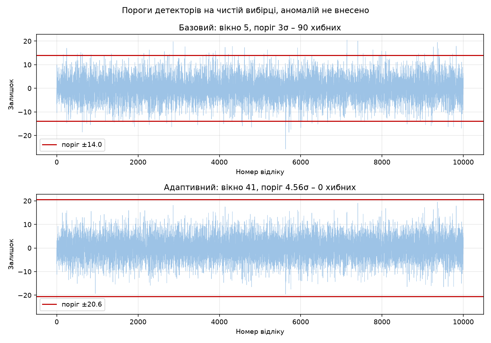

Рисунок 12 – Пороги детекторів на власних залишках чистої вибірки

Фіксований поріг дає 90 хибних спрацювань там, де аномалій немає взагалі, адаптивний –
жодного. При цьому на забрудненій вибірці адаптивний детектор знаходить у 2,2 раза
більше справжніх викидів (таблиця 2). Тобто виграш отримано одночасно за обома
показниками, а не в обмін на чутливість.

## 3.6. Програмний код

Нижче наведено фрагменти, що безпосередньо реалізують моделі розділів 3.1 і 3.5.
Повний код проекту додається до звіту окремим архівом.

Оцінка розсіювання через MAD, поріг за обсягом вибірки та підбір ширини вікна:

```python
def mad_sigma(r):
    """Оцінка СКВ через медіанне абсолютне відхилення: 1.4826 · median(|r − median r|)."""
    return MAD_TO_SIGMA * float(np.median(np.abs(r - np.median(r))))


def threshold(n, alpha=ALPHA):
    """Поріг з обсягу вибірки за поправкою Бонферроні: k = Φ⁻¹(1 − α/2n)."""
    return float(stats.norm.ppf(1.0 - alpha / (2 * n)))


def lag1(r):
    """Автокореляція залишку на лагу 1."""
    c = r - r.mean()
    return float(c[:-1] @ c[1:] / (c @ c))


def best_window(data, windows=WINDOWS):
    """Ширина вікна, за якої |ACF(1)| залишку найменша."""
    return min(windows, key=lambda w: abs(lag1(residual(data, w))))
```

Цикл виявлення з ітеративним уточненням оцінки розсіювання:

```python
def adaptive(data, alpha=ALPHA, rounds=5, windows=WINDOWS):
    window = best_window(data, windows)
    k = threshold(len(data), alpha)
    mask = np.zeros(len(data), dtype=bool)
    for _ in range(rounds):
        r = residual(clean(data, mask), window)
        found = np.abs(r) > k * mad_sigma(r)
        if np.array_equal(found, mask):
            break
        mask = found
    return mask, window, k
```

Навчання за МНК у замкненій формі та екстраполяція:

```python
def design(n, degree, start=0, scale=None):
    """Матриця плану F зі стовпцями 1, τ, τ², … , τᵐ."""
    scale = n if scale is None else scale
    t = np.arange(start, start + n, dtype=float) / scale
    return np.vander(t, degree + 1, increasing=True)


def fit(data, degree):
    """МНК у замкненій формі: C = (FᵀF)⁻¹FᵀY."""
    n = len(data)
    f = design(n, degree)
    coeffs = np.linalg.solve(f.T @ f, f.T @ data)
    return f @ coeffs, coeffs


def extrapolate(coeffs, n, horizon):
    """Прогноз на horizon відліків за межі вибірки."""
    return design(horizon, len(coeffs) - 1, start=n, scale=n) @ coeffs
```

Вибір степеня за помилкою прогнозу на відкладеному хвості:

```python
def select_degree(data, degrees=DEGREES, holdout=HOLDOUT):
    cut = int(len(data) * (1.0 - holdout))
    table = {}
    for m in degrees:
        _, coeffs = fit(data[:cut], m)
        table[m] = {
            "in": scores(data[:cut], design(cut, m) @ coeffs)["RMSE"],
            "out": scores(data[cut:], extrapolate(coeffs, cut, len(data) - cut))["RMSE"],
        }
    return min(table, key=lambda m: table[m]["out"]), table, cut
```

## 3.7. Аналіз результатів та верифікація

Верифікація за відновленням закладених параметрів. Модель навчалася на даних, у які
тренд закладений явно, тому відновлені коефіцієнти можна порівняти з істинними:
$9{,}998 \cdot 10^{-5}$ проти $10^{-4}$ при $t^2$ і $1{,}019 \cdot 10^{-2}$ проти
$10^{-2}$ при $t$. Похибка не перевищує 2 %, причому вона внесена не самим МНК,
а залишковими аномаліями, які детектор не знайшов.

Верифікація за рівнем залишкової помилки. RMSE навченої моделі 6,19 при СКВ похибки 5.
Модель не може мати помилку, меншу за рівень шуму, тому близькість цих значень
підтверджує, що тренд виділено повністю, а решта – невилучна випадкова складова.

Верифікація вибору степеня. Алгоритм обрав $m = 2$ на синтезованих даних, де істинний
степінь тренду дорівнює двом і відомий наперед. Це прямий контроль коректності процедури
оптимізації моделі.

Обмеження детектора на реальних даних. На курсі USD виявлено 34 відліки, або близько
10 % ряду, що для валютного курсу забагато. Причина в характері даних: курс тривалий час
стоїть на одному значенні, тому MAD, обчислений по всьому ряду, виходить дуже малим,
і будь-який рух на ділянках стабільності перевищує поріг. Частина виявленого – справжні
стрибки курсу, а не похибки виміру. Для рядів з різко неоднорідною волатильністю оцінку
розсіювання варто робити локальною, у тому самому ковзному вікні, а не глобальною;
у цій роботі такий варіант не реалізовано.

Обмеження екстраполяції. Прогноз на реальних даних (рисунок 11) розвертається вниз, бо
обраний поліном другого степеня має від'ємний старший коефіцієнт. Формально це найкраща
модель за помилкою прогнозу, але поза інтервалом спостереження поліноміальна екстраполяція
не має фізичного змісту: вона продовжує кривизну, оцінену на минулих даних. Для курсу
валют горизонт у 174 відліки завеликий, і результат слід трактувати як демонстрацію
роботи алгоритму, а не як прогноз курсу.

Порівняння з базовим алгоритмом. Адаптивний детектор переважає базовий одночасно
за точністю (0 проти 90 хибних спрацювань на чистій вибірці) і за повнотою (727 проти
334 виявлених аномалій із 1000). Обидва виграші пояснюються теоретично: перший –
залежністю порога від обсягу вибірки, другий – стійкістю MAD до маскування.

# IV. Висновки

У роботі реалізовано повний конвеєр статистичного навчання за Big Data Time Series:
синтез вхідних даних із заданими в ЛР 1 властивостями, внесення та виявлення аномальних
вимірів, навчання поліноміальної моделі за методом найменших квадратів і екстраполяція
на 0,5 інтервалу спостереження. Виконано всі три групи вимог, рівень складності III.

Метод найменших квадратів у замкненій формі $C = (F^T F)^{-1} F^T Y$ дає точну оцінку
коефіцієнтів за один крок, без ітерацій, оскільки поліноміальна модель лінійна за
параметрами. Практична умова його застосовності на великих обсягах – нормування часу:
без нього матриця $F^T F$ втрачає обумовленість уже при $n = 10^4$ і степені 4.

Показник якості сам по собі не визначає складність моделі. $R^2$, MAE, MSE і RMSE на
навчальній вибірці монотонно поліпшуються зі зростанням степеня, тому оптимізація за ними
призводить до опису шуму. Перевірка на відкладеному хвості вибірки усуває цю ваду й
на синтезованих даних відновлює істинний степінь тренду.

Розроблений власний алгоритм виявлення аномальних вимірів замінює два фіксовані параметри
базового детектора на величини, виведені з властивостей самої вибірки: ширину вікна –
з автокореляції залишку, поріг – з обсягу вибірки за поправкою Бонферроні, оцінку
розсіювання – через медіанне абсолютне відхилення. На вибірці з 10 000 відліків це дало
0 хибних спрацювань проти 90 у базового детектора при одночасному зростанні кількості
виявлених аномалій з 334 до 727.

Основне обмеження запропонованого алгоритму виявлено на реальних даних: глобальна оцінка
розсіювання непридатна для рядів із різко неоднорідною волатильністю. Напрям подальшої
роботи – локальна оцінка MAD у тому самому ковзному вікні, що використовується для
зняття тренду.
